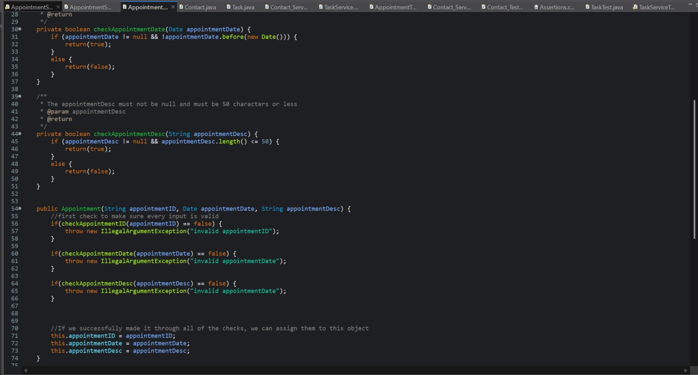
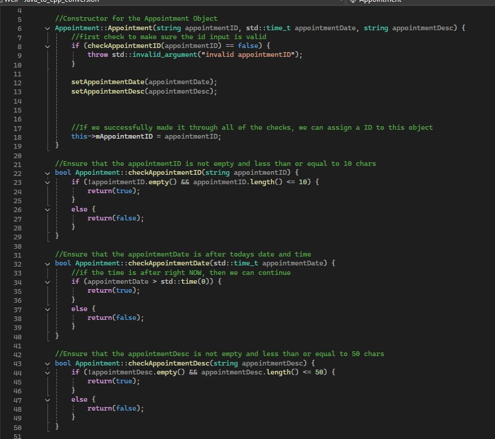
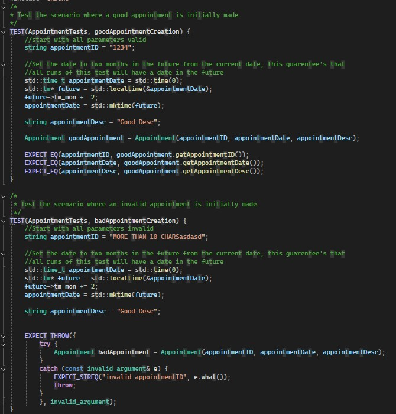
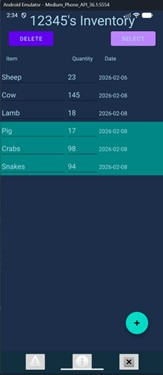
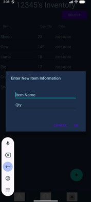
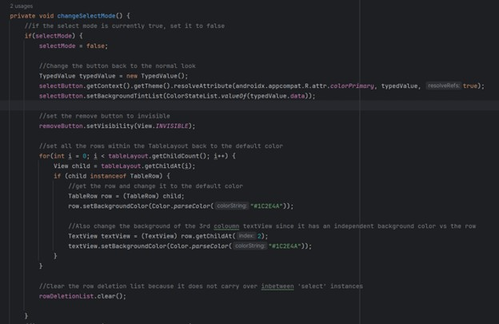
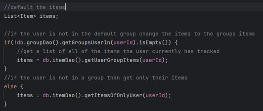

# Portfolio

## About Me
&emsp;Hello, my name is Matthew Weil. I am a graduate from Southern New Hampshire University with a degree in Computer Science. I have been working as a Software Engineer for nearly three years with an embedded systems focus. I've always taken a liking to computers as well as technology in gerenal, and love continuing that passion with the work I do on a daily basis. I have done many different levels of programming from SPI interface programming to UI interfaces for desktop applications. 

&emsp;I code in very many different languages, but here is a couple I am especially proficient in:
- C
- Cpp
- Java
- Python

&emsp;Outside of work I love to bowl and go golfing. As well as work on some of my passion projects. One of the more recent projects I did was creating a 5" FPV drone which I love flying around outside.

## Self-Assessment

&emsp;Throughout the program at SNHU I got to work on a variety of different and unique projects. There are many times where my coursework directly correlated to the work I was actually doing at my job. To me, this shows how valuable and directly correlated to real-world applications the course work actually was. Developing this ePortfolio really helped me reflect on how far I have come since starting university and allowed me to showcase that improvement by going back and enhancing previous projects with my new knowledge. Areas where I really grew and enhanced my ability from before University can be broken down into the following categories:
- Collaborating in a team environment
- Communicating with stakeholders
- Data structures and algorithms
- software engineering and database
- Security

&emsp;Something that I had to do very often throughout the computer science program was peer review other students work. This involved developing constructive criticism of their projects so that they could hopefully use it and improve their project in quality. Of course, it went the other way too. Many times I provided my work to my classmates and took feedback to make my own work better. This amount of feedback is invaluable when it comes to completing projects or applications. Many times my classmates came up with great ideas, or missed a simple bug that I may have overlooked. Collaborating in a team environment is how software developers can actually develop the best code possible and work to their max potential. I really enjoyed the peer reviews because it was a time for me to grow, and reflect on the work I created.
 
&emsp;Communicating with stakeholders, is something that is quite hard to do when you are just a student in University. There are no 'actual' stakeholders banking on my performance of my final project besides myself, but that does not mean that University has failed to prepare me for that situation. There were times throughout the computer science program I was tasked to write a mock email or create a presentation to provide information to stakeholders. Much of this happened in a Software Development Lifecycle class where we discussed the agile software development system and honed in on every step of the process. I also refined my writing ability and presentation skills throughout the program to better get points across to my audience and ensure they walk away with an understanding of what I am conveying to them. One of my greatest strengths as a software engineer and student is communication. Whether it is meeting with a customer or in person or writing a simple email, I always feel comfortable and excel in this area.
 
&emsp;Dealing with data structures and algorithms is something you have to do regularly as a software engineer, and as such, it is something I did often as a computer science student. We dealt with a variety of different data structures in a variety of different languages. Algorithms and especially modularity was something that was touched on extensively. The need for code to be re-used is something that comes up so frequently that modularity is essentially a necessity within software development. It is a skill that I have honed and have become very proficient in as I plan and create large scale projects. Writing a new section of code and finding out that I can actually just re-use my previous algorithms is a great feeling that will never go away.
 
&emsp;Managing and creating databases is something that came up extremely frequently in my classes. I have extreme confidence in creating MongoDB and relational databases. Creating queries within both was something that was extensively covered in my classes, as well as connecting the database to actual code backends’. For MongoDB we frequently used Python as well as Java to create a backend that could reference the MongoDB and grab the appropriate information for operations. With the relational databases we often used SQL to query the database and grab the appropriate information to give to the backend. We often used Python, Java, and Cpp to facilitate the SQL queries and receive the information. Managing databases is something I have become very comfortable doing all the way from the back-end to the front-end.
 
&emsp;Software security is something that is never going to go away. Software security was something that was touched on in almost every single major project that I completed. I understand the need for proper software security to prevent any unwanted leaks or intrusions into systems that a user should not be able to access. Dependency vulnerabilities was a major focus of software security within all of my classes, so that we could learn how to detect and mitigate the risk from dependencies added to the database. Attackers will exploit commonly found vulnerabilities within code bases to gain access to user information or company systems for their own benefit. That is why it is so important for a programmer to stay up to date on common vulnerabilities and update their dependencies regularly. This also extends to running dependency reports on your code base to check the security of your code often. Software security was also taken seriously in how we actually code within our projects and if we have written secure code on our projects. Do we have proper input validation? Can a user crash the program? Do we integrate the principle of least privilege? These are questions we would need to think about as we were coding, to make the correct coding choices.
 
&emsp;When creating this portfolio, it was tough for me to choose exactly what I wanted to showcase my talents. There are so many different facets to actually being a great programmer, and many different skills required to perform each one. Ultimately, I chose what would showcase my skills and abilities on large scale, multi-file projects. Similar to what would be created in a real life work environment. Really, what I want to showcase within my portfolio, is my ability to learn and adapt to new challenges. That is what makes a programmer truly great, reaching a new problem and figuring out a solution instead of giving up. If a programmer can adapt, they can figure out any problem given to them. This portfolio shows my ability to adapt to new problems and my ability to solve these problems in a creative and fulfilling way. My portfolio consists of three artifacts broken out as different enhancements on final projects from my coursework. They encompass three different enhancement categories: Software Design and Engineering, Algorithms and data structures, and Database management. Even doing these enhancements I learned new techniques and strategies that made me a better programmer. Learning does not end when you get out of university, it is a life-long process that makes me a better programmer and a better person. My portfolio starts with a self code review where I analyze my previous projects and showcase what I have learned to do different from their original creation.

## My Previous Work!
1.  [Code Review](#code-review)
2.  [Software Design and Engineering Enhancement](#software-design-and-engineering-enhancement)
3.  [Algorithms and Data structures Enhancement](#algorithms-and-data-structures-enhancement)
4.  [Database Enchancement](#database-enhancement)

## Code Review

  <iframe width="560" height="315" src="https://www.youtube.com/embed/6T51hvn3lhY?si=qGyszgnAJTalWuXe" title="YouTube video player" frameborder="0" allow="accelerometer; autoplay; clipboard-write; encrypted-media; gyroscope; picture-in-picture; web-share" referrerpolicy="strict-origin-when-cross-origin" allowfullscreen></iframe>

--------------

## Software Design and Engineering Enhancement

<a href="https://github.com/Matthew-Weil/CS-320-Enhanced" target="_blank">Artifact Repository</a>

&emsp;The project that I modified was originally created as the final project for CS-320, Software Testing, Automation, and Quality Assurance. It consists of three different packages, labeled: Contact, Task, and Appointment. Each of these included two source Java files and accompanying JUnit tests. The objective of the project was to create and understand unit testing and how it fits into the development life cycle.

&emsp;Now, I have changed the language from java to cpp. Instead of JUnit tests, I created GoogleTest’s (GTests). I recreated every file within the original project in cpp and achieved the same level of tests and 100% code coverage using the GTests format. As an exmaple I have included a simple segment of code that I created for the project in Java, and its transcriped counterpart in cpp. These two examples are shown in Figure 1 and Figure 2.

**Figure 1**

**Figure 2**

&emsp;The main part of this project was the actual unit testing component, which involved testing varius scenarios of the user using functions of my code in both a good way and a bad way. It was my job to test all the possible ways that a user could use these functions to certify that the code will run without flaw in all scenarios. Using GTests really streamlined this process and created an environment that facilitated easy testing of my functions. An example of one of my GTests for the constructor of the Appointment class is shown in Figure 3.

**Figure 3**

&emsp;I included this file in my portfolio because I think testing is one of the most important aspects of code development. If you cannot properly test your code for flaws, then the code cannot be trusted to be integrated seamlessly with other sections of code. Every developer needs to have a solid understanding of testing so that they can self-test their code before handing it off. I changed the language of the project from java to cpp to showcase my ability to understand multiple different languages and different testing techniques within both. I chose cpp since is commonly used in software engineering, which is my desired field. 

&emsp;The course outcome of demonstrating outcome 4: my ability to use well-founded and innovative techniques, skills, and tools to implement computer solutions was demonstrated here. The total artifact demonstrated my ability to use JUnit tests and GTests in both Java and cpp, which is greatly helpful when it comes to testing code.

&emsp;While I was updating this code to cpp I did learn a lot about GTests. It was something that I have experienced very little in the past. One aspect that was tricky, and an improvement over my previous implementation in java, was the ability to detect the type of specific thrown error and its accompanying error message. I wanted to ensure that my GTest cases would not think a different thrown error than the expected error was correct. I did figure out an intuitive method to do so using a try-catch statement within EXPECT_THROW() to figure out the exact error message to match the expected.
	
&emsp;Overall, this artifact is a great demonstration of how I have grown as a developer and how I am able to translate my past skills into new ones.

--------------

## Algorithms and Data structures Enhancement

<a href="https://github.com/Matthew-Weil/CS-360-Enhanced" target="_blank">Artifact Repository</a>

&emsp;This artifact was created for the completion of the final project of CS-360: Mobile Architecture and Programming. I was tasked to create an inventory management mobile application that would run on Android OS. It is needed to provide the user with the ability to track items as well as their quantity. They needed to be able to add and remove items from their tracker, as well as modify the quantity of any item. The algorithm I used for the creation and deletion of items within the inventory did not offer enough functionality for the user to use the app up to its full potential. I added the ability for the user to bulk delete items from the database shown in Figure 4, which got rid of an unsightly deleted button on every single item row.

**Figure 4**

&emsp;The user can delete items by clicking the select button and tapping on all of the items they would like to delete. Once those items are selected, they can click the delete button to permanently delete the selected items from the database.

&emsp;I also changed how a user will add an item to the database by creating a new pop-up window, allowing them to enter item information before it is added to the database. This new screen can be seen in Figure 5.

**Figure 5**

&emsp;Originally, a default item with a name of ‘item name #’ and quantity ‘0’ would be immediately added to the database when the user clicks to add a new item. The creation of this pop-up window allows the user to avoid the creation of that item and instead simply create the item they desire.

&emsp;I added this item to my portfolio because it is a display of my understanding of developing an application around user needs and executing those ideas in a complete and clean manner. This project is one where we were not provided with any sort of template, all of the code was written by me. Since the project is quite large with many lines of code, I thought that it would be a good item to showcase my ability to write complete applications. The completeness of my implementation completely covers all possible scenarios that a user could possibly do while deleting or adding an item. For example, when a user is selecting items to delete but decides they do not want to delete anymore items and click the select button again, the select list is cleared and the items are set back to the default color. This segment of code is shown in Figure 6.

**Figure 6**

&emsp;I originally set out to complete the course outcome of outcome number 4:	Demonstrate an ability to use well-founded and innovative techniques, skills, and tools in computing practices for the purpose of implementing computer solutions that deliver value and accomplish industry-specific goals. I would say that I successfully completed this goal by implementing new and better solutions to adding and deleting an item from the database. However, as I completed this project I continued to find myself accomplishing the goals of number 3: Design and evaluate computing solutions that solve a given problem using algorithmic principles and computer science practices and standards appropriate to its solution, while managing the trade-offs involved in design choice. By adding this completely new algorithm for thuse user to create and  The user experience is greatly improved by the techniques that I used, which will increase the desire that a user would have to use the app. However, my comment structure and proper ability to convey the meaning and intention of my code through comments is also in line with this outcome.
	
&emsp;As I completed this artifact, I continued to learn more about Android studio and using its data structures and objects. I used a TableLayout to display the inventory information, so I learned a lot about how its specific rows work together and how to access the information within each row. I also learned a lot about callbacks and creating sections of code that need to be run when a certain condition is met. These callbacks make the UI usable and customizable by the user since they are able to decide when a section of code needs to be run by tapping a button. Overall, the process of creating this artifact was enjoyable and educational.

--------------

## Database Enhancement

<a href="https://github.com/Matthew-Weil/CS-360-Enhanced" target="_blank">Artifact Repository</a>

&emsp;This project was originally from CS-360 Mobile architecture and design. It was the final project where I was tasked to create a mobile application on android studio to track inventory items with separate user accounts. Prior to my improvement of this project, every user would have their own inventory showing only their items. In a real-world application, there will be times where multiple users need to access and modify the quantity of the same items. For instance, in a single warehouse there may be many user accounts, but they are all working with the same inventory and need to be able to see the modifications of other users. To facilitate this functionality, I added groups to the application, any user can join a group and now look at group items instead of their own. Now every employee within the warehouse can be in the same group and modify the same items.
	
&emsp;This artifact is all about modifying a database to enhance the user experience. I needed to create new tables within my database, new SQLite queries, and parse and process information from the database for display to the user. I also needed to create a new user interface page to allow a user to join a specific group instead of only their own database. I included this artifact because it was a good reflection of my understanding of databases and my ability to create and modify them.
	
&emsp;To create the group functionality, I created a new ‘groups’ table within the database. This table needed to have a many-to-many relationship with the ‘user’ table, so I also created a bridge table called ‘groupUserBridgeTable’. I used an Android Room Database to store these tables and create SQLite database queries to get data back to my main application. An example of the groupDao SQLite queries is shown in Figure 7.

**Figure 7**

&emsp;Since I was using a bridge table to allow the many-to-many relationship, it was sometimes necessary for me to user types of JOIN’s to get the proper information from the database.
	
&emsp;In addition to the modification of the database itself, I also needed to create a new page where the user can join or create a new group. This page was accessed from the bottom left of the main application menu bar, which is always present for a logged in user. An example of the group page is shown in Figure 8.

**Figure 8**

&emsp;It is still possible to use the application without a group at all, focusing solely on your own inventory. Within my Inventory Management file, I added logic to check if the user was in a group, to display the corresponding items (group items / user items). This logic is shown in Figure 9.

**Figure 9**

&emsp;This logic checks every group that the user could possibly be in. If the list of groups is NOT empty, then it will get every item from the user’s groups. If the list of groups is empty, then it will simply grab only the items that belong to the user itself. Items is eventually displayed within a TableLayout on the inventory information page.

&emsp;I did meet the course outcomes that I planned to meet as well as some additional ones through the creation of this artifact. Much of it was focused on modifying the database to allow for groups to be seamlessly integrated. One of the course outcomes accomplished was number one, to enable diverse audiences to support organization decision-making. The creation of groups allows many new users to find functionality within the app. It still allows users to use the app if they want to only use the inventory for themselves, but also adds new functionality to join a group. This artifact also completed number 5, develop a security mindset that anticipates adversarial exploits. SQL injections are something that I always kept in mind while creating this artifact, proper string parsing and proper SQLite querying was used to prevent this from happening. Of course, the total portfolio is a completion of outcome number 2: Design, develop, and deliver professional-quality oral, written, and visual communications. 

&emsp;While making this artifact I did learn a lot about more complicated queries such as using different types of JOIN’s within my queries. It is something I have done before, but not to the extent that I needed to for this project. It also helped me to further understand the complexity of creating full-scale projects and the necessity of modularity within a project. There were many times that I needed to run specific functions over again, called in a different spot. Overall, this project is a great display of my coding ability, and large-scale project development. 
