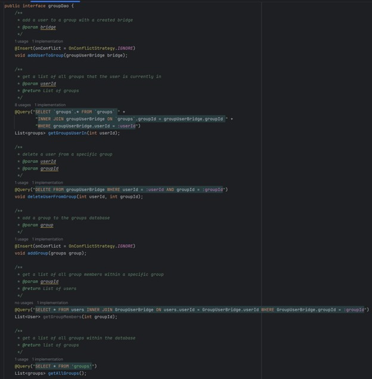
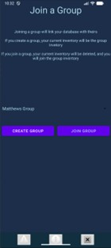

Matthew Weil GitHub Page Creation

## My Previous Work!
1.  [Software Design and Engineering Enhancement](#software-design-and-engineering-enhancement)
2.  [Algorithm Enhancement](#algorithm-enhancement)
3.  [Database Enchancement](#database-enhancement)

## Software Design and Engineering Enhancement

## Algorithm Enhancement

## Database Enhancement

This project was originally from CS-360 Mobile architecture and design. It was the final project where I was tasked to create a mobile application on android studio to track inventory items with separate user accounts. Prior to my improvement of this project, every user would have their own inventory showing only their items. In a real-world application, there will be times where multiple users need to access and modify the quantity of the same items. For instance, in a single warehouse there may be many user accounts, but they are all working with the same inventory and need to be able to see the modifications of other users. To facilitate this functionality, I added groups to the application, any user can join a group and now look at group items instead of their own. Now every employee within the warehouse can be in the same group and modify the same items.
	This artifact is all about modifying a database to enhance the user experience. I needed to create new tables within my database, new SQLite queries, and parse and process information from the database for display to the user. I also needed to create a new user interface page to allow a user to join a specific group instead of only their own database. I included this artifact because it was a good reflection of my understanding of databases and my ability to create and modify them.
	To create the group functionality, I created a new ‘groups’ table within the database. This table needed to have a many-to-many relationship with the ‘user’ table, so I also created a bridge table called ‘groupUserBridgeTable’. I used an Android Room Database to store these tables and create SQLite database queries to get data back to my main application. An example of the groupDao SQLite queries is shown in Figure 1.

**Figure 1**

Since I was using a bridge table to allow the many-to-many relationship, it was sometimes necessary for me to user types of JOIN’s to get the proper information from the database.
	In addition to the modification of the database itself, I also needed to create a new page where the user can join or create a new group. This page was accessed from the bottom left of the main application menu bar, which is always present for a logged in user. An example of the group page is shown in Figure 2.

**Figure2**

It is still possible to use the application without a group at all, focusing solely on your own inventory. Within my Inventory Management file, I added logic to check if the user was in a group, to display the corresponding items (group items / user items). This logic is shown in Figure 3.

**Figure3**

This logic checks every group that the user could possibly be in. If the list of groups is NOT empty, then it will get every item from the user’s groups. If the list of groups is empty, then it will simply grab only the items that belong to the user itself. Items is eventually displayed within a TableLayout on the inventory information page.
I did meet the course outcomes that I planned to meet as well as some additional ones through the creation of this artifact. Much of it was focused on modifying the database to allow for groups to be seamlessly integrated. One of the course outcomes accomplished was number one, to enable diverse audiences to support organization decision-making. The creation of groups allows many new users to find functionality within the app. It still allows users to use the app if they want to only use the inventory for themselves, but also adds new functionality to join a group. This artifact also completed number 5, develop a security mindset that anticipates adversarial exploits. SQL injections are something that I always kept in mind while creating this artifact, proper string parsing and proper SQLite querying was used to prevent this from happening. 
While making this artifact I did learn a lot about more complicated queries such as using different types of JOIN’s within my queries. It is something I have done before, but not to the extent that I needed to for this project. It also helped me to further understand the complexity of creating full-scale projects and the necessity of modularity within a project. There were many times that I needed to run specific functions over again, called in a different spot. Overall, this project is a great display of my coding ability, and large-scale project development. 
